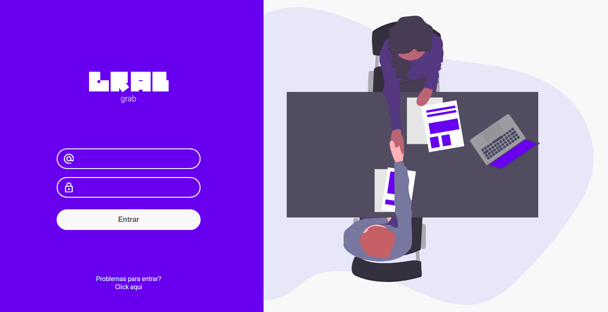
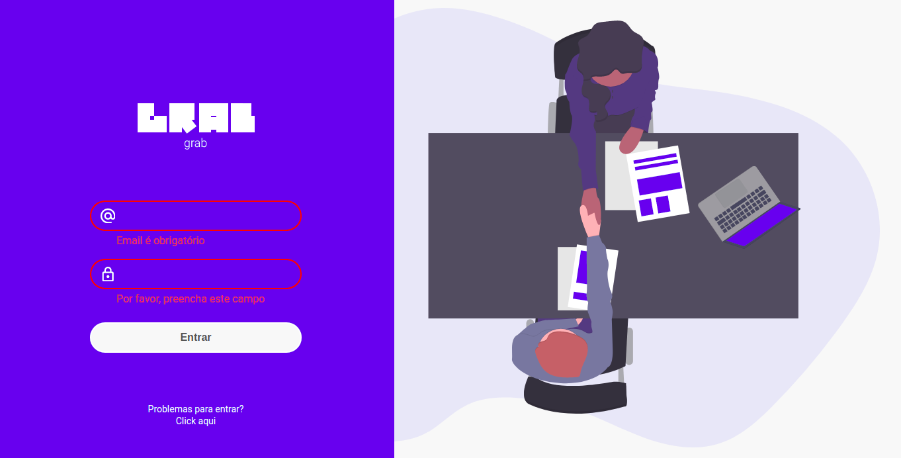
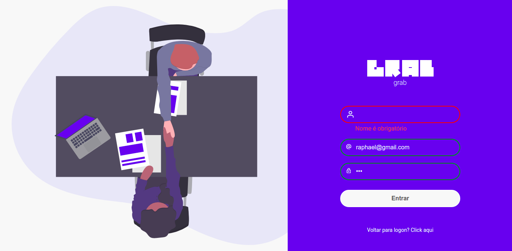

# Page Login GRAB - Desafio DevChallenge

[Preview no Youtube](https://www.youtube.com/watch?v=psTuLDxRp4E)

  

  
  
   
   
  

  <h3 align="center">Grab - Página de login</h3>

  <a href="https://grab-devchallenge.vercel.app/index.html">Preview</a> | 
  <a href="https://www.linkedin.com/in/raphaelgregg/">Contato</a>

## 🎮 Sobre o desafio
Desafio <a href="https://devchallenge.com.br/challenges/5f261924ecb9243236c05385/details">Grap - pagina de login</a>, no site <a href="https://devchallenge.com.br/">DevChallenge</s>, criado por <a href="https://www.linkedin.com/in/magdielndantas/">Magdiel Dantas</a>.

  * Criar uma página de login e verificar se o formulário foi preenchido corretamente.

## 💻 Meu Projeto
Foram criadas as seguintes Fetures:
* [X] Criação pagina login
* [X] Criação pagina criar conta
* [X] Validação de campos com msgs personalizas

## 🚀 Tecnologias

- HTML
- CSS
- JavaScript

## Author
**Raphael Gregg**

✉️ <a href="tomail:raphaelgregg@gmail.com">raphaelgregg@gmail.com</a>

<a href="https://www.linkedin.com/in/raphaelgregg/">linkedin: Raphael Gregg</a>

